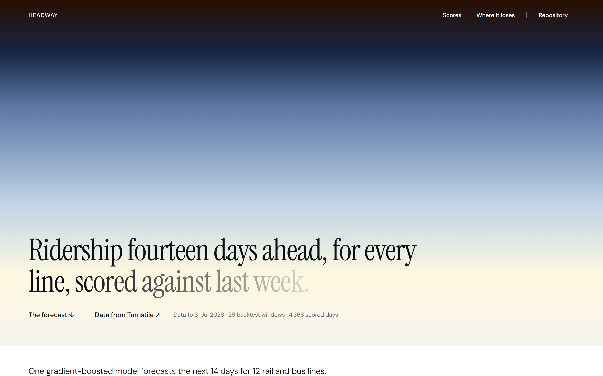
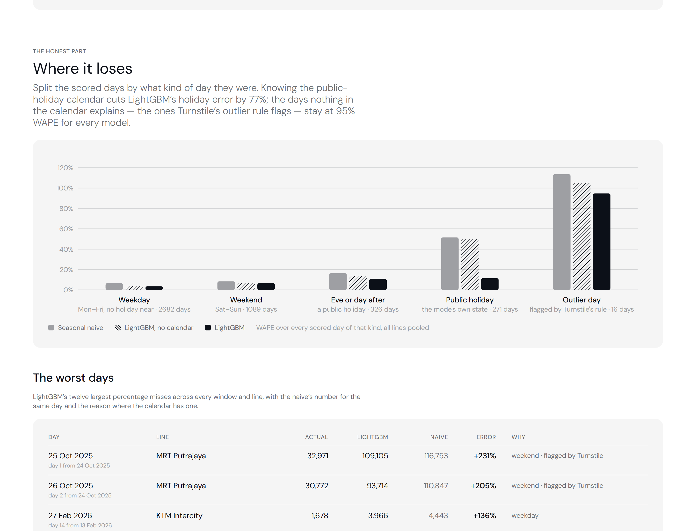

# Headway

Data from [Turnstile](https://turnstile-tawny.vercel.app) · live dashboard link to follow once deployed



A fourteen-day ridership forecast for every Malaysian rail and bus line in
[Turnstile](https://github.com/direenvy/turnstile)'s checked data — twelve lines,
from LRT Kelana Jaya at 260,000 trips a day to KTM Intercity at 3,000 — and, more
to the point, an honest account of how good it is. One gradient-boosted model is
backtested over 52 weeks against three baselines, scored with a metric that is
comparable across lines, and taken apart by kind of day so the reader can see
exactly where it wins (public holidays it was told about) and where nothing
wins (the disruption days Turnstile's outlier rule flags).

Headway forecasts only what Turnstile has already checked: its input is the
table Turnstile publishes after its eleven checks pass, not the raw feed.

## Results

Rolling-origin backtest: 26 origins, one every 14 days from 1 Aug 2025 to
17 Jul 2026, each model seeing only the data up to the origin and forecasting
the next 14 days. 12 lines × 26 origins × 14 days = 4,368 scored days per model.

| Model | MASE | WAPE | Bias | What it is |
|---|---:|---:|---:|---|
| **LightGBM** | **0.77** | **5.0%** | +1.5% | One model over all lines: 28 lags, same-weekday lags, the horizon, the state's public-holiday calendar |
| LightGBM, no calendar | 0.98 | 7.3% | +3.4% | The same model with every holiday feature removed |
| ETS | 1.12 | 8.9% | +0.7% | Holt-Winters on the last year: damped trend, weekly seasonality, log trips |
| Weekday mean | 1.19 | 8.8% | −0.1% | Mean of the last four same weekdays — the baseline Turnstile's outlier rule uses |
| Seasonal naive | 1.30 | 9.7% | +0.8% | Last week's value for the same weekday |

**MASE** is mean absolute error divided by the in-sample one-step error of the
seasonal naive over the training period (April 2022 to the first origin), so
1.00 means "as good as copying last week" and a 190,000-trip line and a
3,000-trip line are on the same scale. The overall figure averages the per-line
MASE, one vote per line. **WAPE** is the sum of absolute errors over the sum of
trips, pooled — the number a planner would quote.

LightGBM beats the seasonal naive on every one of the 12 lines by MASE, and is
the best of the five models on every line. Two lines stay above 1.00 even so — KTM ETS (1.18) and Rapid Bus Penang (1.02) — and the
seasonal naive itself scores 1.30 out of sample: the scored year was harder than
the years the scale was measured on.

### By kind of day

WAPE over every scored day of that kind, all lines pooled:

| Kind of day | Days | Seasonal naive | LightGBM, no calendar | LightGBM |
|---|---:|---:|---:|---:|
| Weekday, no holiday near | 2,682 | 6.6% | 3.9% | **3.5%** |
| Weekend | 1,089 | 8.4% | 6.6% | **6.5%** |
| Eve or day after a holiday | 326 | 16.4% | 13.9% | **10.8%** |
| Public holiday (the line's own state) | 271 | 51.5% | 50.0% | **11.5%** |
| Day flagged by Turnstile's outlier rule | 16 | 113.6% | 105.0% | 94.7% |



## Three things worth explaining

**The calendar is most of the model.** Strip the public-holiday features out and
LightGBM's MASE goes from 0.77 to 0.98 — from a clear win over the naive to
roughly the weekday mean. The whole difference is on 271 holiday days out of
4,368: 11.5% WAPE with the calendar, 50.0% without, which is the same 50% the
naive gets, because a model that does not know Thursday is Hari Raya predicts a
Thursday. Every line uses its own state's calendar (`holidays.Malaysia`,
subdivision per line: KUL for the Klang Valley lines, PNG for Rapid Bus Penang,
JHR for the Tebrau shuttle, PRK for Komuter Utara, national for ETS and
Intercity) — Federal Territory Day moves LRT Kelana Jaya and not the Penang bus.

**ETS wins day one and loses every day after.** At one day ahead the
exponential-smoothing baseline scores 0.63 to LightGBM's 0.66: a smoothed level
plus yesterday's information is hard to beat for tomorrow. By day two LightGBM
is ahead (0.74 to 0.86) and ETS spends the rest of the fortnight between 1.1 and
1.4, because it has no idea a holiday is coming. The seasonal naive's error
jumps at day 8, where it has to reach back two weeks instead of one; LightGBM's
does not, because its same-weekday lags are chosen per horizon.

**The worst days are the ones no calendar has.** The single largest miss is MRT
Putrajaya on 25 October 2025: 32,971 trips against a forecast of 109,105, 231%
off, and the naive was no better at 116,753. That is the weekend disruption
Turnstile's outlier rule flagged (0.28× its baseline). The 16 scored days
Turnstile flags average 95% WAPE for LightGBM and worse for everything else —
they are not forecastable from ridership history, and the dashboard says so
rather than hiding them in an average. Seven of the twelve worst days are KTM
Intercity, at 3,000 trips a day the smallest service scored, where a few hundred
trips is a large percentage and nothing in the calendar explains them.

## The forecast ahead

The dashboard's headline chart is the next fourteen days from the last date
Turnstile has published, for each line, with an 80% band. The band is not a
formula's: it is the 10th and 90th percentile of the backtest's own log errors
at that horizon, pooled across lines, applied multiplicatively. A model that
was wrong by 12% at day ten in the backtest gets a band 12% wide at day ten.

## How it's built

```
headway/
  config.py     paths, the twelve series with their holiday subdivision, HORIZON, N_ORIGINS, TRAIN_FROM
  data.py       fetch Turnstile's ridership.csv and outliers.json; wide daily table; per-state calendar features
  models.py     seasonal_naive · weekday_mean · ets · LightGBM features (vectorised) · fit · predict
  backtest.py   rolling origins; one long table of (origin, mode, h, date, actual, model, yhat)
  metrics.py    MASE / WAPE / bias by any grouping; day-type and outlier labels
  forecast.py   every model on all the data, 14 days ahead, empirical 80% intervals
  marts.py      the JSON the dashboard imports
  run.py        python -m headway.run all [--fetch]
frontend/       Next.js 16, hand-rolled SVG, New Genre design (DESIGN.md)
results/        backtest.csv (21,840 rows), forecast.csv, timings.json — committed, so every number on the site is reproducible
tests/          10 tests: the baselines on a clean weekly cycle, the calendar, feature alignment, MASE = 1 for the scale model, no origin leaks
```

**Features.** For origin *t* and horizon *h*: log1p(trips) at lags 0–27 relative to
the 28-day log level; the four most recent same-weekday values relative to the
target day (lag 7⌈h/7⌉ and the three weeks before it); 7-day mean, the 7 days
before that, 28-day log spread; the horizon; the target day's weekday, day of
year, holiday flag, eve and day-after flags, days to the next and since the last
holiday; how many holidays fell inside the last week of lags; the series as a
categorical. Target is the log ratio to the level, so one model serves every
scale. L1 objective, 400 rounds, learning rate 0.05, 31 leaves, fixed seed.
Training rows are every (series, origin, horizon) whose target day the backtest
origin has already seen — about 250,000 by the last origin — built once and
filtered per origin, so the whole backtest takes about six minutes.

**Training window.** From 1 April 2022. Everything before is the
movement-control-order regime, and a model asked to explain 2020 learns things
that are false in 2026.

**Refresh.** `refresh.yml` runs weekly, fetches Turnstile's latest table, re-runs
the backtest and the forecast, and commits `results/` and `frontend/data/` as
`headway-bot`; Vercel redeploys. `ci.yml` runs the tests and rebuilds the marts
from the committed backtest on every push.

## Running it

```bash
pip install -r requirements-dev.txt
python -m pytest -q
python -m headway.run all --fetch     # ~6 min: backtest, forecast, marts
cd frontend && npm install && npm run dev
```

`--fetch` downloads `ridership.csv` and `outliers.json` from the Turnstile repo
into `data/` (gitignored). `python -m headway.run marts` alone rebuilds the
dashboard's JSON from the committed `results/`.

## Limitations

- **Every origin is a Friday.** Origins are 14 days apart, so horizon 1 is
  always a Saturday and horizon 3 always a Monday; the by-horizon chart is partly
  a by-weekday chart. A step of 13 or 15 days would rotate the weekday at the
  cost of overlapping windows.
- **Public holidays only.** School holidays, Ramadan (which depresses evening
  ridership for a month) and long-weekend bridging days are not in the calendar;
  the 10.8% error on holiday-adjacent days is where they show.
- **No exogenous events.** Disruptions, fare changes, new stations and the
  weather are invisible; the outlier-day row in the table above is the cost.
- **Intervals are pooled across lines.** A single 80% band per horizon is right
  on average and too narrow for KTM Intercity, too wide for LRT Kelana Jaya.
- **The scale year is not the scored year.** MASE is anchored to April 2022 –
  July 2025; the naive scoring 1.30 out of sample says the last twelve months had
  more holiday and disruption variance than that period, so the absolute numbers
  are conservative and the comparisons between models are what to read.
- **LRT Shah Alam is excluded** (63 days of history) and Rapid Bus Kuantan
  (retired December 2025).

## Data and licences

- *Daily Public Transport Ridership*, Prasarana Malaysia and the Ministry of
  Transport via [data.gov.my](https://data.gov.my/data-catalogue/ridership_headline),
  CC BY 4.0 — as published by Turnstile after its checks. Trips, not passengers.
- Public holidays: the [`holidays`](https://pypi.org/project/holidays/) package
  (MIT), Malaysia with state subdivisions.
- Design: the New Genre reference in `DESIGN.md`. Instrument Serif and DM Sans
  via Google Fonts.
